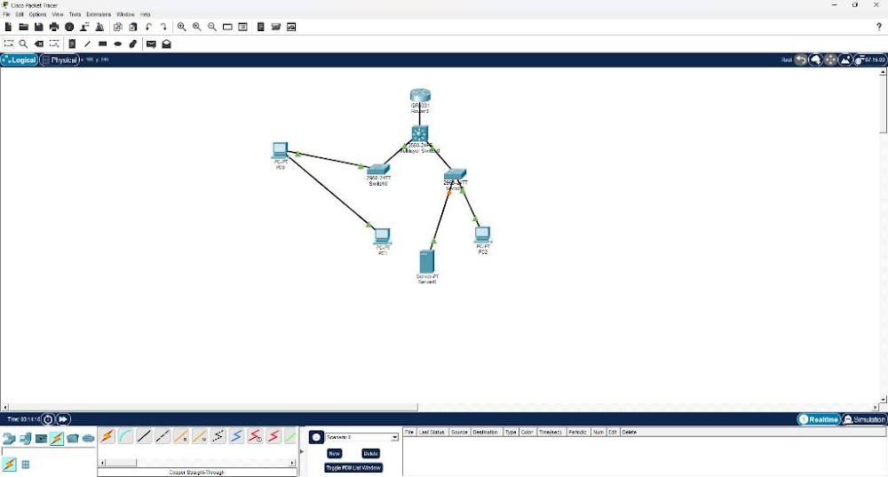
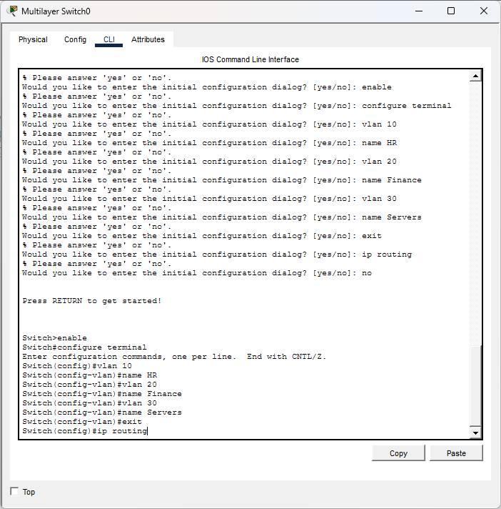
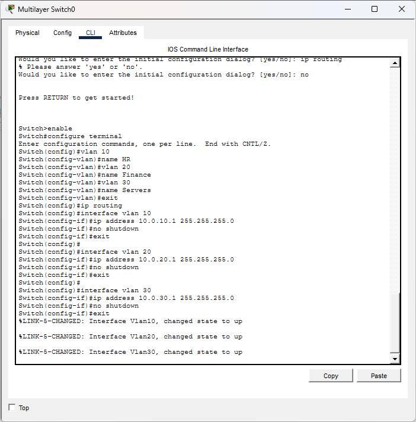
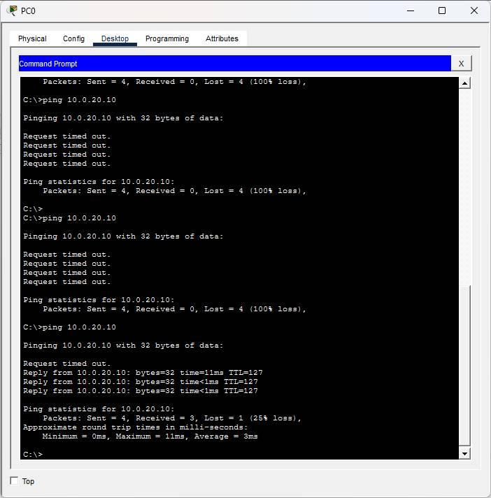

# Darwin-Enterprise-Campus-Network-Lab
Advanced Cisco Packet Tracer lab implementing an enterprise multi-department campus network using Layer 3 switching, Switch Virtual Interfaces (SVIs), 802.1Q port trunking, and Inter-VLAN routing verification.

A hands-on Cisco Packet Tracer lab implementing an advanced multi-department corporate network topology. This project demonstrates network segmentation using Virtual Local Area Networks (VLANs), Layer 3 Inter-VLAN routing, and 802.1Q trunking encapsulation on a Multilayer Core Switch.

---

## 🗺️ Network Topology Map

*Figure 1: Enterprise core distribution network design featuring segmented department LAN zones communicating across a central 3560 Multilayer Core Switch.*

---

## 📊 Corporate Subnet & IP Addressing Table

| Device | Interface | VLAN Assignment | IP Address | Subnet Mask | Default Gateway | Purpose |
| :--- | :--- | :--- | :--- | :--- | :--- | :--- |
| **PC0** | FastEthernet0 | VLAN 10 (HR) | 10.0.10.10 | 255.255.255.0 | 10.0.10.1 | HR Workspace End Device |
| **PC1** | FastEthernet0 | VLAN 10 (HR) | 10.0.10.11 | 255.255.255.0 | 10.0.10.1 | HR Workspace End Device |
| **PC2** | FastEthernet0 | VLAN 20 (Finance) | 10.0.20.10 | 255.255.255.0 | 10.0.20.1 | Finance Workspace Client |
| **Server0** | FastEthernet0 | VLAN 30 (Servers) | 10.0.30.10 | 255.255.255.0 | 10.0.30.1 | Central Server Farm Node |
| **Core-SW** | Vlan 10 | SVI Gateway | 10.0.10.1 | 255.255.255.0 | N/A | HR Department Default Gateway |
| **Core-SW** | Vlan 20 | SVI Gateway | 10.0.20.1 | 255.255.255.0 | N/A | Finance Department Gateway |
| **Core-SW** | Vlan 30 | SVI Gateway | 10.0.30.1 | 255.255.255.0 | N/A | Server Farm Default Gateway |

---

## 🛠️ Configuration Steps & Implementation Details

* **Layer 3 Inter-VLAN Routing**: Initialized the `ip routing` engine on the 3560 Multilayer Switch and deployed Switch Virtual Interfaces (SVIs) for VLANs 10, 20, and 30 to serve as default gateways.
* **802.1Q Port Trunking**: Formed standard **802.1Q trunk lines** across the core switch backbone links using `switchport trunk encapsulation dot1q` to allow secure multi-VLAN tagged traffic traversal.
* **Access Boundary Hardening**: Segmented lower Cisco 2960 switches by turning off dynamic trunking protocols and pinning endpoint interfaces directly to discrete department spaces using `switchport mode access`.

---

## 🔍 Engineering Verification & Configuration Proofs

### 1. Multilayer Switch SVI Initialization

*Figure 2: Successful deployment of virtual gateways and global IP routing commands inside the Multilayer Switch terminal.*

### 2. Core Distribution Layer Trunking Execution

*Figure 3: Configuring the fastEthernet interface range paths to force 802.1Q encapsulation protocols.*

### 3. Cross-Department Inter-VLAN Ping Resolution

*Figure 4: ICMP validation test from HR PC0 navigating cross-subnet pathways to successfully ping Finance PC2 with 0% packet loss.*
